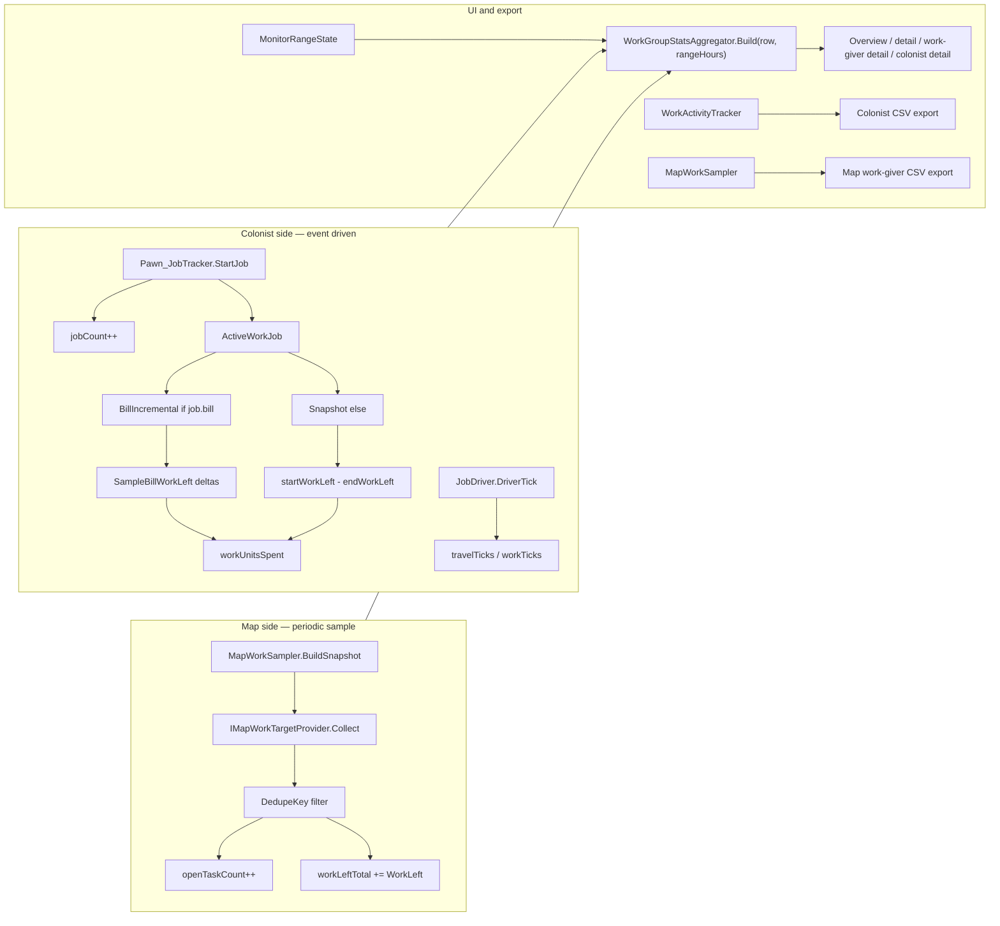
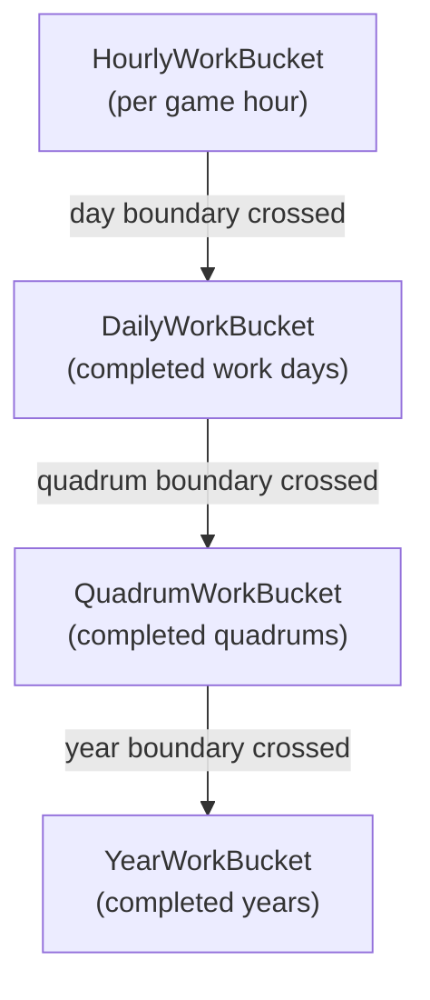

# WorkMonitor — development reference

Read-only RimWorld mod that tracks colonist work activity and map backlog, organized by work type for the Work tab monitor UI.

---

## Mod packaging

| Path | Role |
|------|------|
| [`About/About.xml`](About/About.xml) | RimWorld 1.6; packageId `philip2p2026.workmonitor` |
| **Dependencies** | Harmony (`brrainz.harmony`), **Work Tab** (`Fluffy.WorkTab`) — hard requirement |
| **Load after** | Customize your WorkGroup (`philip2p2026.worktabgroups`) — optional integration |
| [`Languages/English/Keyed/WorkMonitor.xml`](Languages/English/Keyed/WorkMonitor.xml) | ~150 keyed strings |
| `1.6/Assemblies/WorkMonitor.dll` | Built output |
| **No `Defs/`** | All behavior via Harmony + `GameComponent`s (atypical for RimWorld mods; intentional) |

---

## Glossary

| Term | Meaning |
|------|---------|
| **WorkGiver** (`WorkGiverDef`) | RimWorld def for a single job type (e.g. `DoBillsCook`, `Mine`). Jobs reference one via `job.workGiverDef`. |
| **Work type** (`WorkTypeDef`) | Work-tab column (Cooking, Construction, …). Contains ordered `workGiversByPriority`. Primary unit for **UI navigation** (see [UI views](#ui-views)). |
| **Monitor row** | One row in the WorkType list. Usually one work type; with Customize your WorkGroup may be a custom bucket; unassigned mod work givers appear as **Other**. Code name: `WorkGroupSnapshot` (legacy “group” — avoid in UI copy). |
| **Storage key** | Stable id for a monitor row: `WorkType:Cooking`, `CustomGroup:MyGroup`, `Other:Other`. Built by `WorkGroupKey.StorageKey`. |
| **Job** | Countable colonist metric. Incremented on `Pawn_JobTracker.StartJob` when `workGiverDef` is set and the work giver is **not** endless. |
| **Endless job** | Station/long-running job start counted separately from regular jobs: Research, Drill, Ground Penetrating Scan, Operate Scanner (`EndlessWorkGiverUtility`). Shown in the **Endless** column. |
| **Work unit** | Numeric “work done” (bill `workLeft` deltas, frame/mine progress, etc.). Not all jobs produce work units. Charts and sums include `estimatedWorkUnitsSpent` when actual tracking is unavailable. |
| **Estimated work unit** | Work credited via `WorkUnitEstimator` (pawn work-speed stat × work ticks) when work-left tracking fails. Stored as `estimatedWorkUnitsSpent` on buckets/records. |
| **Range** | UI-selected rolling window (`MonitorRangeState.RangeHours`) for tables and charts. Presets from 6 h through 5 years; shared across all monitor views. |
| **Work day** | In-game day boundary for rollup and map new-today (`dayRolloverHour`, default 05:00; options 00:00, 05:00, 08:00). Distinct from UI range. |
| **Tier buffer** | `WorkHistoryTierBuffer` — hourly/daily/quadrum/year colonist history with automatic rollup and caps. |
| **Tick** | RimWorld time unit. **2500 ticks = 1 in-game hour** (`WorkMonitorSettings.TicksPerHour`). |
| **Travel tick** | Tick spent while `pawn.pather.MovingNow` during an active job. |
| **Work tick** | Tick spent not traveling during an active job. |
| **Open task** (map) | One scannable backlog target at sample time (`openTaskCount++`). |
| **Work left** (map) | Estimated remaining work on a target (`workLeftTotal += target.WorkLeft`). |
| **New today** (map) | Subset of open tasks/work first seen on the current work day (`newTodayOpenTaskCount`, `newTodayWorkLeftTotal`). UI shows as `total(newToday)`. Day boundary uses `dayRolloverHour` and map longitude. |
| **Countable** | Whether a metric is non-zero for a work giver. Colonist jobs: almost always yes. Map: only when a provider finds a target. |
| **Work gatherable** | Whether work units can be measured. Colonist: bill incremental or snapshot work-left. Map: when `WorkLeft > 0` on the target. |
| **Snapshot mode** | Non-bill jobs: `workDelta = max(0, startWorkLeft - endWorkLeft)` at job end. |
| **Bill incremental mode** | Bill jobs: sum positive deltas of `JobDriver_DoBill.workLeft` each tick. |
| **Scanned map target** | One deduped backlog item from a provider (`ScannedMapTarget`). |
| **Attribution** | Mapping a map target to one or more `WorkGiverDef`s (`MapWorkAttribution`). |
| **Primary work giver** | First entry in `workType.workGiversByPriority` — used as fallback for loose UFT. |
| **Status** | Work-type row health color: Grey (no capable colonists), Red (disabled or stale), Yellow/Green (recent work by enabled colonists). |

---

## Architecture

Two independent data paths feed the UI and CSV exports:



**Colonist stats** update immediately on job start/end and each driver tick. History rolls hourly → daily → quadrum → year in `WorkHistoryTierBuffer`.

**Map stats** update on a configurable interval (1/2/3/6/12 in-game hours) for the current map only. New-today subsets tracked per `DedupeKey` across samples.

All monitor pages and both CSV exports read from the same two `GameComponent` stores: `WorkActivityTracker` (colonist) and `MapWorkSampler` (map). See [CSV export](#csv-export) for how export slices differ from UI aggregation.

---

## Source layout

```
Source/
├── WorkMonitorMod.cs              # Mod entry, Harmony, settings UI
├── WorkMonitorSettings.cs         # User settings
├── WorkMonitorUtility.cs          # Time formatting, colonist enumeration
├── Groups/                        # Monitor rows + stat aggregators (WorkGroup* — code legacy naming)
│   ├── WorkGroupKey.cs, WorkGroupSnapshot.cs, WorkGroupKeyResolver.cs
│   ├── WorkGiverAssignmentIndex.cs
│   ├── WorkTabGroupsIntegration.cs
│   ├── WorkGroupOrderUtility.cs, WorkActivityStatus.cs, WorkGroupStats.cs
│   ├── IWorkGroupProvider.cs    # Extension point for monitor rows
│   ├── WorkTypeGroupProvider.cs, WorkTabGroupsProvider.cs, OtherWorkGroupProvider.cs
│   ├── WorkGroupStatsAggregator.cs  # WorkGroupRegistry + WorkGroupStatsAggregator
│   ├── ColonistStatsAggregator.cs, WorkGiverStatsAggregator.cs
│   ├── ColonistWorkQuery.cs, ColonistOverviewTreeBuilder.cs
├── Tracking/
│   ├── WorkActivityTracker.cs     # Colonist job/work/tick tracking
│   ├── WorkHistoryTierBuffer.cs   # Hourly → daily → quadrum → year rollups
│   ├── HourlyWorkBucket.cs, CoarseWorkBuckets.cs, PawnBucketMergeUtility.cs
│   ├── WorkActivityRecord.cs, WorkMonitorSaveData.cs, ColonistWorkProfile.cs
│   ├── WorkLeftResolver.cs, EndlessWorkGiverUtility.cs, WorkUnitEstimator.cs
│   ├── MapWorkSampler.cs, MapWorkSnapshot.cs
│   ├── WorkHistoryRingBuffer.cs   # Legacy / unused — no references
│   └── MapWork/
│       ├── IMapWorkTargetProvider.cs, MapWorkProviderRegistry.cs
│       ├── MapWorkAttribution.cs, MapWorkEstimate.cs, ScannedMapTarget.cs
│       ├── MapWorkFrameUtility.cs, GrowerSowMapUtility.cs
│       └── Providers/             # 16 classes — one scan source each
├── Export/
│   └── WorkMonitorCsvExporter.cs
├── Patches/
│   ├── Patch_RecordWorkActivity.cs
│   ├── Patch_BillWorkProgress.cs
│   ├── Patch_Game_ComponentRegistration.cs
│   ├── Patch_History_WorkMonitorTab.cs
│   └── Patch_WorkTab_MonitorButton.cs
└── UI/
    ├── WorkMonitorContentHost.cs, MonitorRangeState.cs
    ├── WorkGroupOverviewPanel.cs, WorkGroupDetailPanel.cs
    ├── WorkGiverDetailPanel.cs, ColonistDetailPanel.cs
    ├── WorkGroupChartPanel.cs, WorkGroupMonitorWindow.cs
    ├── WorkChartDataBuilder.cs    # + DualStreamChart (used), DualLineChart (unused)
    ├── BulkExpandUtility.cs, OverviewLayoutMode.cs
    ├── WorkMonitorTableColumns.cs, MonitorRowKind.cs
    ├── WorkMonitorUiUtility.cs, WorkMonitorDropdownUtility.cs
    ├── WorkGiverLabelUtility.cs, WorkGiverSkillMarkerMode.cs, WorkGiverSkillUtility.cs
    ├── WorkTypeLabelUtility.cs
    ├── ColonistInspectUtility.cs, WorkTabHighlightController.cs
```

---

## Core types and functions

### `WorkActivityTracker` (`GameComponent`)

Colonist-side tracker. Singleton via `Instance` / `EnsureRegistered()`.

| Method | Purpose |
|--------|---------|
| `RecordJobStart(pawn, workGiver, job, tick)` | Finalize prior job, increment `jobCount` or `endlessJobCount`, start `ActiveWorkJob` (bill or snapshot mode). |
| `RecordJobEnd(pawn, workGiver, endingJob, tick)` | Finalize active job: ticks, travel/work split, snapshot work delta, bill flush. |
| `SampleBillWorkLeft(pawn, tick)` | Incremental bill work-left credit while job runs. |
| `SampleJobTick(pawn, tick)` | Classify tick as travel vs work on active job. |
| `GetRecord(pawnId, workGiverDefName)` | Lifetime `WorkActivityRecord` per pawn × work giver. |
| `SumPawnWorkGiverJobs/Ticks/WorkUnits/TravelTicks/WorkTicks/EndlessJobs(...)` | Sum pawn tier buffers since `minHourIndex` (hourly + rolled-up daily/quadrum/year when range exceeds hourly retention; see [Data retention](#data-retention)). |
| `EnumeratePawnWorkGiverHistory()` | All pawn × work-giver tier buffers; used by colonist CSV export. |
| `GetGroupHistory(storageKey)` | `WorkHistoryTierBuffer` aggregated by monitor row. |
| `PruneStaleData()` | Drop buckets older than retention; roll hourly → daily → quadrum → year. |

**`ActiveWorkJob`** fields: `workGiverDefName`, `startTick`, `travelTicks`, `workTicks`, `trackingMode`, `tracksWorkLeft`, `startWorkLeft`, `lastBillWorkLeft`, `accumulatedWorkUnits`.

**`WorkActivityRecord`** fields: `lastWorkTick`, `jobCount`, `endlessJobCount`, `ticksSpent`, `travelTicksSpent`, `workTicksSpent`, `workUnitsSpent`, `estimatedWorkUnitsSpent`.

### `WorkHistoryTierBuffer` (`IExposable`)

Multi-resolution colonist history. See [Data retention](#data-retention) for rollup chain, caps, and query rules.

| Method | Purpose |
|--------|---------|
| `GetOrCreateBucket(hourIndex)` | Hourly bucket for live recording. |
| `SumJobCount/SumEndlessJobCount/SumTicksSpent/SumWorkUnits/...` | Range sums across hourly + daily + quadrum + year (group buffers). |
| `SumPawnJobCount/SumPawnTicks/...` | Range sums across hourly + daily + quadrum + year pawn fields (`SumPawnFloat`). Hourly list itself is capped at 72 h. |
| `RollupIfBoundaryCrossed(absTick, longitude)` | Merge completed periods into coarser tiers. |
| `EstimateHourlyFromDaily(...)` | Interpolate chart points when hourly data was pruned. |
| `Configure(hourlyRetentionHours)` | Cap hourly list length (6–72). |

### `EndlessWorkGiverUtility` (static)

`IsEndless(workGiver)` — true for `Research`, `Drill`, `GroundPenetratingScan`, `OperateScanner`.

### `WorkUnitEstimator` (static)

`TryEstimateWorkUnits(pawn, workGiver, job, workTicks, out units)` — credits work from pawn speed stat when work-left tracking is unavailable (common for endless station jobs).

### `WorkLeftResolver` (static)

| Method | Purpose |
|--------|---------|
| `TryGetWorkLeft(job, pawn, out workLeft)` | Bill driver, reflected driver `workLeft`, or target thing (`Frame`, `UnfinishedThing`, `Mineable`). |
| `TryGetBillDriverWorkLeft(pawn, out workLeft)` | `JobDriver_DoBill.workLeft`. |
| `TryGetThingWorkLeft(thing, out workLeft)` | Frame / UFT / mineable hit points. |
| `TryGetBillBacklog(bill, out workLeft, out countable)` | Map-side bill backlog (Forever / TargetCount / RepeatCount + bound UFT). |

### `MapWorkSampler` (`GameComponent`)

| Method | Purpose |
|--------|---------|
| `TrySampleIfDue(force)` | Sample current map when hour aligns with `mapSampleIntervalHours`. |
| `BuildSnapshot(map, hourIndex, sampleTick)` | Run all providers, dedupe, roll up per work giver and monitor row. |
| `GetLatestSnapshot()` | Most recent `MapWorkSnapshot`. |
| `GetHistory()` | Retained snapshot list for map charts (see [Map snapshot history](#map-snapshot-history)). |
| `NormalizeInterval(hours)` | Clamp to 1, 2, 3, 6, or 12. |

**`MapWorkSnapshot`** contains `perWorkGiver` and `perGroupKey` dicts. Each entry has `openTaskCount`, `newTodayOpenTaskCount`, `workLeftTotal`, `newTodayWorkLeftTotal`, plus snapshot `hourIndex` and `sampleTick`. `MapWorkSampler` tracks `taskFirstSeenDayId` per `DedupeKey` for new-today attribution.

### `MapWorkAttribution` (static)

| Method | Purpose |
|--------|---------|
| `ResolveWorkGiversForBillGiver(thing, bill)` | Match `fixedBillGiverDefs`, else primary WG of recipe work skill’s work type. |
| `ResolveWorkGiversForUnfinished(unfinished)` | Skip bound UFT; else primary WG of recipe work type. |
| `PrimaryWorkGiversForWorkType(workType)` | `[workGiversByPriority[0]]`. |
| `ConstructFinishFramesWorkGiver()` | `ConstructFinishFrames` or construction primary. |
| `MineWorkGiver()` / `DrillWorkGiver()` | Named lookup with fallback. |
| `GroupKeysFor(workGivers)` | Distinct group storage keys for attribution. |

### `ScannedMapTarget` (struct)

| Field | Purpose |
|-------|---------|
| `DedupeKey` | Global dedup within one snapshot (e.g. `frame:123`, `bill:loadId`). |
| `WorkLeft` | Work units credited to attributed work givers/groups. |
| `WorkGiverDefNames` | One or more work givers (multi-attribution for bills, frame delivery). |
| `GroupKeys` | Optional; defaults from work givers via `WorkGroupKeyResolver`. |

### `MapWorkEstimate` (static)

Helpers for provider work-left estimates: `FromFrame`, `FromMineable`, `FromFilth`, `FromPlantCut`, `FromThingDeconstruct`, `FromRepair`, `FromSmoothCell` (1500), `ResearchRemaining()`, `FromRecipe`.

### Monitor rows (`Groups/` — code naming)

| Type | Purpose |
|------|---------|
| `WorkGroupKey` | `ForWorkType`, `ForCustomGroup`, `ForOther` → `StorageKey`. |
| `WorkGroupSnapshot` | `Key`, `Label`, `WorkGivers`, `UniqueWorkTypes`, `PrimaryWorkType`. |
| `WorkGroupRegistry.GetAllGroups()` | Cached monitor rows (250-tick cache). Defined in `WorkGroupStatsAggregator.cs`. |
| `IWorkGroupProvider` | Extension point for monitor rows (parallel to `IMapWorkTargetProvider` for map scanning). |
| `WorkGroupKeyResolver.ResolveGroupKeysForWorkGiver(wg)` | Delegates to `WorkGiverAssignmentIndex` (same rules as monitor rows). |
| `WorkGiverAssignmentIndex` | Cached WG → storage-key lookup; rebuilt with `WorkGroupRegistry` (250-tick cache). |

**`WorkGroupRegistry.GetAllGroups()`** assembly (250-tick cache):

1. `WorkTypeGroupProvider` — one row per `WorkTypeDef` (unassigned work givers only when Customize your WorkGroup is active; skips empty rows)
2. `WorkTabGroupsProvider` — custom rows when Customize your WorkGroup is present
3. `OtherWorkGroupProvider` — unassigned mod work givers → **Other**
4. `WorkGroupOrderUtility.Sort` — order from `WorkLayoutOrder` when available, else `PawnTableDefOf.Work.columns`; **Other** always last

Monitor row visibility is **def-gated** (current `DefDatabase` only). Pawn×workGiver save/CSV history is **not** pruned when content mods are disabled.

**Adding a monitor row provider:** implement `IWorkGroupProvider`, return `WorkGroupSnapshot` entries, wire into `WorkGroupRegistry.GetAllGroups()`.

| Type | Purpose |
|------|---------|
| `WorkGroupStatsAggregator.Build(row, rangeHours)` | Merges colonist history + map snapshot into `WorkGroupStats`. |
| `WorkGroupStatsAggregator.BuildAll(rangeHours)` | All rows for overview/charts. |
| `ColonistStatsAggregator.Build(pawn, rangeHours)` | Per-colonist rollup across monitor rows. |
| `ColonistStatsAggregator.BuildGroupDetail(pawn, group, rangeHours)` | Per–work-giver breakdown for one colonist × row (expanded rows). |
| `WorkGiverStatsAggregator.Build(group, workGiver, rangeHours)` | Single work-giver detail stats. |
| `WorkActivityStatus` | `Grey`, `Red`, `Yellow`, `Green`. |

Stat DTOs in `WorkGroupStats.cs`: `WorkGroupStats`, `ColonistWorkStat`, `WorkGiverStat`, `ColonistGroupWorkDetail`, `WorkGiverDetailStats`, etc. All include `EndlessJobCount` where job starts apply.

### `MonitorRangeState` (`Source/UI/`)

Shared range selector on every monitor view. `RangeHours` drives aggregator `minHour` (`MinHourIndex = CurrentHourIndex() - RangeHours`) and chart span.

#### UI range presets

| Preset | `RangeHours` | In-game span | Chart resolution |
|--------|-------------|--------------|------------------|
| 6 h | 6 | 6 hours | Hourly (`UsesHourlyChart`) |
| 12 h | 12 | 12 hours | Hourly |
| 24 h | 24 | 1 day | Hourly |
| 48 h | 48 | 2 days | Hourly |
| 7 d | 168 | 7 days | Daily (`UsesDailyChart`) |
| 14 d | 336 | 14 days | Daily |
| 4 quadrums | 1440 | ~1 RimWorld year (60 days) | Daily buckets in tables; charts use daily series where implemented |
| 8 quadrums | 2880 | ~2 years | Coarser `WorkHistoryTierBuffer` tiers for group totals |
| 3 years | 4320 | 3 years | Coarser tiers |
| 5 years | 7200 | 5 years | Coarser tiers |

Default preset: `WorkMonitorSettings.defaultRangePreset` (24 h).

Charts: colonist job/work series use hourly points when `UsesHourlyChart` (≤ 48 h), else `BuildDailySeries` (up to 14 day-buckets). Map chart series always use hourly steps over `rangeHours` but are limited by [map snapshot history](#map-snapshot-history) (≤ 80 samples).

---

## Data retention

Colonist and map metrics use different storage layers. The UI range can be longer than fine-grained history; tables and charts degrade gracefully.

### Storage layers

| Layer | Location | Granularity | Typical use |
|-------|----------|-------------|-------------|
| **Lifetime record** | `WorkActivityRecord` per pawn × work giver | All-time totals | `lastWorkTick`, status color, never pruned while colonist tracked |
| **Group tier buffer** | `WorkHistoryTierBuffer` per monitor-row `storageKey` | Hourly → daily → quadrum → year | Group totals, charts, `GetGroupHistory().Sum*` |
| **Pawn tier buffer** | `WorkHistoryTierBuffer` per pawn × work giver | Hourly recording (72 h cap) + rolled-up daily/quadrum/year | `SumPawnWorkGiver*` for colonist/work-giver table rows; colonist CSV export |
| **Map snapshot history** | `MapWorkSampler.historyBuffer` | One sample per map interval | Map chart time series (hold-forward); map work-giver CSV export |
| **Map latest** | `MapWorkSampler.latestSnapshot` | Current sample | Table **ExistJob** / **ExistWork** columns |
| **New-today tracking** | `MapWorkSampler.taskFirstSeenDayId` | Per `DedupeKey`, current save | `newToday*` fields until target disappears |

### Colonist tier rollup

Triggered each prune tick via `WorkHistoryTierBuffer.RollupIfBoundaryCrossed` (uses map longitude + `dayRolloverHour`).



| Tier | Bucket type | Rolled up when | Default cap (setting) | Approx. max span at default |
|------|-------------|----------------|----------------------|----------------------------|
| **Hourly** | `HourlyWorkBucket` | Live recording; pruned after 72 h | `MaxRetentionHours` = **72** (hard constant) | 3 days |
| **Daily** | `DailyWorkBucket` | Completed work day &lt; current day | `maxDailyBuckets` = **20** | ~20 days |
| **Quadrum** | `QuadrumWorkBucket` | Completed quadrum &lt; current quadrum | `maxQuadrumBuckets` = **12** | ~12 quadrums (~3 RimWorld years) |
| **Year** | `YearWorkBucket` | Completed year &lt; current year | `maxYearBuckets` = **7** (or unlimited) | ~7 years |

When a tier exceeds its cap, the **oldest** bucket is dropped (`RemoveAt(0)`).

**Work day** id: `year * 1000 + dayOfYear` after shifting `absTick` by `dayRolloverHour` (`0`, `5`, or `8` in-game hour — mod settings slider). Used for daily rollup and map new-today.

### Retention settings

| Setting | Default | Effect |
|---------|---------|--------|
| `chartHistoryHours` | 24 | **Legacy / unused** — saved for compatibility; not applied |
| `statsWindowHours` | 24 | Fallback range when `ResolveRetentionHours()` is called without an active UI range. **No settings UI.** |
| `maxDailyBuckets` | 20 | Max completed daily buckets kept. **No settings UI** (defaults only). |
| `maxQuadrumBuckets` | 12 | Max completed quadrum buckets kept. **No settings UI.** |
| `maxYearBuckets` | 7 | Max completed year buckets kept. **No settings UI.** |
| `yearHistoryUnlimited` | false | When true, year buckets are never capped. **No settings UI.** |
| `dayRolloverHour` | 5 | When the work day rolls over for rollup and map new-today (00:00, 05:00, or 08:00) |

`ResolveRetentionHours(activeRangeHours)` = `clamp(min(activeRangeHours ?? statsWindowHours, 72), 6, 72)` — always ≤ 72 h; governs pawn-buffer `Configure()` on create.

### Prune schedule

`WorkActivityTracker.PruneStaleData()` runs on `GameComponentTick` (every 250 ticks) and when the game hour changes:

1. **Group buffers** — `RollupIfBoundaryCrossed` → `Configure(72)` → `PruneHourlyRetention` (drop hourly older than 72 h).
2. **Pawn buffers** — `ConfigurePawnHistory()` (72 h) → `PruneHourlyRetention`.
3. **Stale colonists** — remove pawn records and pawn tier buffers when pawn leaves colony.

Group-level `SumJobCount` / `SumWorkUnits` / etc. query hourly + daily + quadrum + year tiers (see `SumFloat` in `WorkHistoryTierBuffer`). **Per-pawn** `SumPawn*` methods use the same tier mix via `SumPawnFloat` — hourly buckets for the last 72 h, plus rolled-up daily/quadrum/year pawn fields for older hours inside the UI range.

`WorkGroupStatsAggregator` overwrites group `Total*` fields from `GetGroupHistory().Sum*` when available. Colonist rows sum pawn buffers per work giver; group charts read the group buffer directly. Both are fed by the same tracker events but are separate buffer instances.

### Map snapshot history

| Rule | Value |
|------|-------|
| Sample cadence | `mapSampleIntervalHours`: 1, 2, 3, 6, or 12 in-game hours |
| History drop | Remove snapshots with `hourIndex` &lt; `CurrentHourIndex() - 72` |
| Hard list cap | `MaxRetentionHours + 8` = **80** snapshots max |
| Chart behavior | Hold-last-value forward per hour slot (`BuildMapMetricSeries`) |

Map table columns always read **latest** snapshot only (not range-summed). Map charts can show backlog trends over the retained window (~72 h of hourly slots, subject to sample interval).

### Range vs. what you actually see

| UI range | Group table totals | Per-colonist / per-WG rows | Colonist chart | Map chart |
|----------|-------------------|---------------------------|----------------|-----------|
| ≤ 48 h | Full tier sum | Hourly pawn detail | Hourly points | Hourly hold-forward (~72 h data) |
| 7–14 d | Full tier sum | Hourly (≤ 72 h) + daily pawn fields for older days | Daily buckets | Hourly slots (sparse samples) |
| ≥ 4 quadrums | Full tier sum (coarse) | Hourly + daily/quadrum/year pawn fields | Daily series; coarser for very long spans | Mostly sparse / flat outside 72 h window |

### Time constants

| Constant | Value |
|----------|-------|
| `WorkMonitorSettings.TicksPerHour` | 2500 |
| `MaxRetentionHours` | 72 (hard cap on hourly colonist + map history window) |
| RimWorld day | 24 h = 24 hour-indices |
| RimWorld quadrum | 15 days |
| RimWorld year | 60 days = 1440 h (= `MonitorRangePreset.Quadrums4` span) |

---
### `WorkMonitorUtility` (static)

`MonitorColonists()`, `CurrentHourIndex()`, `CurrentTicksGame()`, `FormatDuration()`, `FormatWorkUnits()`, `FormatSampleAge()`, `FormatGameDateTime()`, `DayRolloverHour()`, `GetWorkDayId()`.

### `WorkMonitorSettings`

| Setting | Default | Purpose |
|---------|---------|---------|
| `statsWindowHours` | 24 | Fallback for `ResolveRetentionHours()` when no UI range is active. **No settings UI.** |
| `chartHistoryHours` | 24 | **Legacy / unused** — serialized only. |
| `defaultRangePreset` | 24 h | Initial `MonitorRangeState` preset. |
| `overviewLayoutMode` | `WorkTypeColonistFirst` | Overview tree layout (`OverviewLayoutMode`); migrates from legacy `groupDetailWorkGiverFirst` on load. |
| `greenStatusHours` / `yellowStatusHours` | 6 / 12 | Status color thresholds. |
| `refreshIntervalTicks` | 60 | Overview panel refresh cadence. |
| `mapSampleIntervalHours` | 1 | Map sampler interval (1/2/3/6/12). |
| `dayRolloverHour` | 5 | In-game hour when “today” resets for map new-today counts (00:00, 05:00, or 08:00). |
| `maxDailyBuckets` / `maxQuadrumBuckets` / `maxYearBuckets` | 20 / 12 / 7 | Coarse history caps. **No settings UI.** |
| `yearHistoryUnlimited` | false | Disable year-bucket cap when true. **No settings UI.** |
| `showTimeInHours` | true | Display ticks as hours. |
| `skillMarkerMode` | `Parentheses` | Text marker for skill-related work givers: Off, `(skill) label`, or `* label`. Migrates from legacy `showSkillOnWorkGiverLabels` on load. |
| `workGiverSkillOverrides` | `""` | `WorkGiverDef=true/false` comma list. |
| `monitorWindowSize` | 720×520 | Standalone monitor window size. **No settings UI.** |

#### Mod settings UI

Exposed in `WorkMonitorMod.DrawSettingsContents` (mod options):

- Default range preset and overview layout (sliders on one row)
- Day rollover slider (00:00, 05:00, 08:00; default 05:00)
- Green/yellow status thresholds and UI refresh interval (ticks)
- Show time in hours; skill marker slider (Off / (skill) / *; default (skill))
- Work-giver skill overrides
- Map sample interval (cycle 1/2/3/6/12 h; default 1 h)
- CSV export: colonist, map work-giver, both, open export folder

Not in settings UI: `statsWindowHours`, `chartHistoryHours`, retention bucket caps, `monitorWindowSize` (overview layout also on settings row; in-monitor layout toggle still syncs the same setting).

---

## Map work providers

Registered in `MapWorkProviderRegistry.All` (order matters only for collection; dedupe is by `DedupeKey`).

| Provider | Scans | Work giver(s) | Work left |
|----------|-------|---------------|-----------|
| `BillMapWorkProvider` | `IBillGiver` bill stacks | `fixedBillGiverDefs` match or primary by recipe skill | `TryGetBillBacklog` |
| `FrameMapWorkProvider` | Building frames with `WorkLeft > 0` | `ConstructFinishFrames` | `frame.WorkLeft` |
| `FrameDeliveryMapWorkProvider` | Frames needing materials | `ConstructDeliverResourcesToFrames`, `DeliverResourcesToFrames` | 0 (count only) |
| `MineDesignationMapWorkProvider` | `Mine` / `MineVein` designations on mineables | `Mine` | `Mineable.HitPoints` |
| `UnfinishedThingMapWorkProvider` | Loose UFT (`workLeft > 0`, unbound) | Primary WG of recipe work type | `unfinished.workLeft` |
| `DesignationMapWorkProvider` | Cell/thing designations (cut, harvest, smooth, paint, deconstruct, …) | Per-rule `WorkGiverDefName` | Rule estimator or 0 |
| `BrokenDownBuildingMapWorkProvider` | `CompBreakdownable.BrokenDown` | `FixBrokenDownBuilding` | `FromThingDeconstruct` |
| `ListerFilthMapWorkProvider` | Home-area filth | `CleanFilth` | `FromFilth` |
| `ListerFireMapWorkProvider` | Fires on map | `FightFires` | `fireSize * 100` |
| `ListerRepairMapWorkProvider` | Damaged repairable buildings | `Repair` | `FromRepair` |
| `ListerHaulablesMapWorkProvider` | `listerHaulables` | `HaulGeneral` / `HaulCorpses` | 0 |
| `ListerRefuelMapWorkProvider` | Empty `CompRefuelable` | `Refuel` / `RearmTurrets` | 0 |
| `CompBuildingMapWorkProvider` | `CompDeepDrill` ready to drill | `Drill` | 0 |
| `ZoneGrowingMapWorkProvider` | Growing zone harvestable plants / empty sow cells | `GrowerHarvest` / `GrowerSow` | plant harvest / sow work |
| `SnowClearMapWorkProvider` | Home cells with snow | `CleanClearSnow` | `depth * 100` |
| `SingletonResearchMapWorkProvider` | Active research project | `Research` | `ResearchRemaining()` |

**Adding a provider:** implement `IMapWorkTargetProvider`, append to `MapWorkProviderRegistry.AllProviders`, emit `ScannedMapTarget` with a unique `DedupeKey`.

---

## Colonist tracking rules

### Jobs (countable)

**Yes** for any colonist job where `job.workGiverDef != null`, hooked from `Pawn_JobTracker.StartJob`.

**Endless jobs** (separate counter): `Research`, `Drill`, `GroundPenetratingScan`, `OperateScanner`. Increment `endlessJobCount` instead of `jobCount`. UI **Jobs** column excludes endless; **Endless** column shows them.

### Work units (gatherable)

| Job kind | Mechanism | Work = 0 when |
|----------|-----------|---------------|
| Bill (`job.bill != null`) | Incremental `JobDriver_DoBill.workLeft` each tick + end flush | Driver unreadable |
| Other | Snapshot: `startWorkLeft - endWorkLeft` at job end | `TryGetWorkLeft` fails at start or end |

Work-left sources (in order): bill driver → reflected `workLeft` on `JobDriver` → job target `Frame` / `UnfinishedThing` / `Mineable`.

Jobs like haul, clean, tend, flick, etc. record **jobs and ticks** but typically **work units = 0** unless estimated.

When work-left tracking fails but work ticks were recorded, `WorkUnitEstimator` may credit **`estimatedWorkUnitsSpent`** (included in `SumWorkUnits` and charts).

### Ticks

Each `JobDriver.DriverTick`: if `pawn.pather.MovingNow` → travel tick, else work tick. Reconciled to elapsed time on job end.

---

## Map tracking rules

### Countable

Each unique `ScannedMapTarget` (after `DedupeKey` filter) adds **1** to `openTaskCount` per attributed work giver and group.

### Work gatherable

Same target adds `WorkLeft` to `workLeftTotal`. Many providers use **0 work left** for pure “task exists” targets (haul, refuel, drill ready, frame delivery, hunt designation).

### New today

On first sighting of a `DedupeKey`, `MapWorkSampler` records `taskFirstSeenDayId`. Targets whose first-seen day equals the current work day increment `newTodayOpenTaskCount` and `newTodayWorkLeftTotal` (in addition to totals). Stale keys not in the latest snapshot are removed from tracking.

### Attribution quirks

- **Bills** → all work givers with matching `fixedBillGiverDefs`; multiple WGs can share one bill target.
- **Loose UFT** → primary WG of recipe work type; bound UFT is skipped (counted via its bill).
- **Frames** → `ConstructFinishFrames` (not construction primary).
- **Mine designations** → `Mine` only (not `Drill`; drill uses `CompBuildingMapWorkProvider`).
- **Per-WG map row sums** can exceed work-type **Total** when one target maps to multiple work givers; work-type totals are deduplicated by `DedupeKey`.

---

## Harmony patches

| Patch | Source file | Target | Effect |
|-------|-------------|--------|--------|
| `Patch_RecordWorkStart` / `Patch_RecordWorkEnd` | `Patch_RecordWorkActivity.cs` | `Pawn_JobTracker.StartJob` / `EndCurrentJob` | End prior job, then `RecordJobStart` / `RecordJobEnd`. |
| `Patch_JobDriverTick` | `Patch_BillWorkProgress.cs` | `JobDriver.DriverTick` | `SampleJobTick`; `SampleBillWorkLeft` for bills. |
| `Patch_Game_Constructor` / `Patch_Game_FinalizeInit` | `Patch_Game_ComponentRegistration.cs` | `Game` | Register `WorkActivityTracker` and `MapWorkSampler`. |
| `WorkMonitorHistoryTab`, `Patch_History_*` | `Patch_History_WorkMonitorTab.cs` | History tab | Embed Work Monitor UI (`WorkMonitorContentHost`). |
| `Patch_WorkTab_MonitorButton` | `Patch_WorkTab_MonitorButton.cs` | Work tab | Open standalone monitor window. |

Harmony id: `philip2p2026.workmonitor`.

---

## UI views

The monitor is hosted by `WorkMonitorContentHost` in two places:

- **History → Work** sub-tab (`WorkMonitorHistoryTab` in `Patch_History_WorkMonitorTab.cs`)
- **Standalone window** from the Work tab Monitor button (`WorkGroupMonitorWindow` via `Patch_WorkTab_MonitorButton`)

Both entry points use the same `WorkMonitorContentHost` instance pattern and share navigation/range state within each host.

**UI naming uses work type**, not “group”. Code still uses `WorkGroup*` types (`WorkGroupSnapshot`, `WorkGroupDetailPanel`, …) for monitor rows — that is implementation naming only; do not use “group” in player-facing labels. Some translation keys in `WorkMonitor.xml` still say “group” (e.g. `WorkMonitor.Group`, `GroupByColonist`); prefer WorkType in new copy.

### The four views

| UI name | Content | `MonitorView` | `ColonistDetailView` | Panel(s) | Translation key |
|---------|---------|---------------|----------------------|----------|-----------------|
| **WorkType overview** | **WorkType list** — expandable tree (WorkType → colonist/work giver → work giver/colonist) with status, interest, map + colonist KPIs | `Overview` | — | `WorkGroupOverviewPanel` | `WorkMonitor.OverviewTitle` |
| **WorkType detail** | **Charts**, expandable **Colonist list**, **WorkGiver list** (map backlog) for one row | `GroupDetail` | — | `WorkGroupDetailPanel`, `WorkGroupChartPanel` | `WorkMonitor.DetailTitle` (`{workType} — Detail`) |
| **WorkGiver detail** | Charts + colonist table for one work giver within a row | `WorkGiverDetail` | — | `WorkGiverDetailPanel`, `WorkGroupChartPanel` | (work giver label in dropdown) |
| **Colonist work detail** | **Work list** — per–work-giver breakdown for one colonist; **Time share** column (% of colonist ticks per work giver vs total) | `ColonistDetail` | `GroupWorkDetail` | `ColonistDetailPanel` | `WorkMonitor.ColonistWorkDetailTitle` (`{colonist} — {workType}`) |

**Enum definitions** (`Source/UI/`):

```csharp
// WorkMonitorContentHost.cs
public enum MonitorView { Overview, GroupDetail, WorkGiverDetail, ColonistDetail }

// ColonistDetailPanel.cs
public enum ColonistDetailView { GroupsSummary, GroupWorkDetail }
```

`ColonistDetailView.GroupsSummary` is an internal back-navigation state (work-type summary table inside `ColonistDetailPanel`); it is not a top-level `MonitorView`. UI name for the active screen remains **Colonist work detail** when `MonitorView.ColonistDetail` is set.

Enums and `WorkGroup*` type names are **not yet aligned** with UI vocabulary (WorkType overview / detail).

### Navigation

```
WorkType overview (expandable WorkType tree)
        │ click WorkType row (not ▶/▼) → WorkType detail
        │ click colonist sub-row → Colonist work detail
        │ click work giver sub-row → WorkGiver detail
        ▼
WorkType detail (chart · colonist list · work giver list)
        │ click work giver row (map or expanded colonist sub-row)
        ▼
WorkGiver detail (chart · colonist list for one WG)
        │ colonist row / work icon
        ▼
Colonist work detail (work list)
        │ Back → WorkGiver detail (if opened from WG) or WorkType detail
        ▼
WorkType detail
        │ colonist row (non-expanded click) or work icon
        ▼
Colonist work detail
        │ Back
        ▼
WorkType detail
        │ Back
        ▼
WorkType overview
```

**WorkType overview tree:** Layout toggle cycles **By colonist** (WorkType → colonist → WorkGiver) / **By work giver** (WorkType → WorkGiver → colonist) / **By colonist (top)** (colonist → WorkType → WorkGiver). Setting: `overviewLayoutMode` (`OverviewLayoutMode`); legacy `groupDetailWorkGiverFirst` bool migrates on load. WorkType detail layout toggle switches only the first two modes. Expand ▶/▼ on WorkType and L1 rows (and colonist L0 in top layout); separate **Expand all** and **Collapse all** buttons (each advances one level per click). WG-first L1 includes work givers with colonist activity in range **or** map backlog (`ExistJob` / `ExistWork` > 0). Colonist-first appends an **Unassigned backlog** pseudo-colonist row (`PawnId = 0`) at the end of each expanded WorkType when map-only work givers exist; same row on WorkType detail colonist table. Sub-rows reuse overview columns: map backlog on WorkType and work-giver rows; colonist processed metrics on colonist rows; interest on WorkType rows only. Click anywhere on a row (except ▶/▼) navigates to the matching detail view. L2 data from `ColonistStatsAggregator.BuildGroupDetail` and `WorkGiverStatsAggregator.Build` (lazy-cached). Colonist-top layout uses `ColonistOverviewTreeBuilder`; unassigned backlog is a final L0 node.

**WorkType detail colonist table:** expand/collapse per colonist (▶/▼) to show per–work-giver metrics; separate **Expand all** and **Collapse all** buttons with the same progressive one-level-per-click behavior (`BulkExpandUtility`). WG-first rows use the same colonist-or-map visibility rule as overview. Expanded rows use `ColonistStatsAggregator.BuildGroupDetail`. KPI columns show jobs/h and work/h for the selected range.

Opening **colonist work detail** from WorkType or WorkGiver detail pre-selects that work type (and work giver when applicable). Back from colonist detail returns to WorkGiver detail when `returnWorkGiver` was set.

### Entry points

| Action | Result |
|--------|--------|
| Open History → Work tab | **WorkType overview** |
| Work tab → Monitor button | **WorkType overview** (standalone `WorkGroupMonitorWindow`) |
| Click a WorkType row (overview) | **WorkType detail** for that row |
| Click colonist sub-row (overview) | **Colonist work detail** |
| Click work giver sub-row (overview) | **WorkGiver detail** |
| Overview layout toggle | Cycle colonist-first / work-giver-first / colonist-top (overview); detail toggles first two only |
| WorkType dropdown on detail | Switch detail row without returning to overview |
| Range dropdown (any view) | Change `MonitorRangeState`; rebuilds stats/charts |
| Highlight button | `WorkTabHighlightController.HighlightGroup` — jumps to Work tab |
| Click work giver row (map table or expanded colonist sub-row) | **WorkGiver detail** |
| WorkGiver dropdown on WorkGiver detail | Switch work giver within current row |
| Colonist row click / work icon | **Colonist work detail** (pawn + current work type) |
| Colonist dropdown | Switch pawn; preserves work-type scope when possible |

### UI source files

| File | Role | `MonitorView` | `ColonistDetailView` |
|------|------|---------------|----------------------|
| `WorkMonitorContentHost.cs` | View routing, shared `MonitorRangeState` | all | — |
| `MonitorRangeState.cs` | Range presets and span hours | — | — |
| `WorkMonitorTableColumns.cs` | Shared column rects for colonist/work-giver tables | — | — |
| `WorkGroupOverviewPanel.cs` | WorkType overview — expandable tree, layout toggle, progressive expand | `Overview` | — |
| `BulkExpandUtility.cs` | Shared progressive expand/collapse helpers | — | — |
| `OverviewLayoutMode.cs` | Overview layout enum (3 modes) | — | — |
| `ColonistOverviewTreeBuilder.cs` | Colonist-top overview tree data | — | — |
| `WorkGroupDetailPanel.cs` | WorkType detail — colonist list + map WorkGiver list | `GroupDetail` | — |
| `WorkGroupChartPanel.cs` | Charts — `DualStreamChart` (colonist/map stream + map new-today stack) | `GroupDetail`, `WorkGiverDetail` | — |
| `WorkGiverDetailPanel.cs` | WorkGiver detail — single-WG colonist breakdown | `WorkGiverDetail` | — |
| `ColonistDetailPanel.cs` | Colonist work detail — work list | `ColonistDetail` | `GroupWorkDetail` (also `GroupsSummary` internally) |
| `WorkChartDataBuilder.cs` | Chart series from tier buffers + map history; `DualStreamChart` (used), `DualLineChart` (unused — `ChartModeLine` string orphaned) | — | — |
| `WorkGroupMonitorWindow.cs` | Standalone window (Work tab monitor button) | hosts `WorkMonitorContentHost` | — |
| `WorkMonitorUiUtility.cs` | Shared drawing/formatting (`FormatTimeShare`, stat labels) | — | — |
| `WorkMonitorDropdownUtility.cs` | WorkType / colonist / work-giver dropdowns | — | — |
| `WorkGiverLabelUtility.cs`, `WorkGiverSkillMarkerMode.cs`, `WorkGiverSkillUtility.cs` | Text skill markers on work-giver labels and passion resolution | — | — |
| `ColonistInspectUtility.cs` | Open colonist bio from info icon | — | — |
| `WorkTabHighlightController.cs` | Highlight matching Work Tab column | — | — |
| `MonitorRowKind.cs` | Row kind enum (Colonist / WorkType / WorkGiver / Total) | — | — |

---

## UI data flow

1. `MonitorRangeState` — user-selected span; `MinHourIndex = CurrentHourIndex() - RangeHours`.
2. `WorkGroupRegistry.GetAllGroups()` — monitor rows for the WorkType list (250-tick cache).
3. `WorkGroupStatsAggregator.Build(row, rangeHours)` — colonist sums from `WorkActivityTracker` tier buffers + map row from `MapWorkSampler.GetLatestSnapshot()`. Group-level totals prefer `GetGroupHistory(storageKey)` when present.
4. Map columns in work-giver rows: **ExistJob** / **ExistWork** = `openTaskCount` / `workLeftTotal` with `total(newToday)` suffix; colonist **Jobs** / **Endless** / **Work** / **Walk** / **Work time** = spent metrics in range.
5. Charts (`WorkChartDataBuilder`) read `WorkHistoryTierBuffer` + `MapWorkSampler.GetHistory()`; resolution and retention limits in [Data retention](#data-retention).

Detail panels use `ColonistStatsAggregator`, `WorkGiverStatsAggregator`, and `WorkChartDataBuilder` under `Source/UI/`.

### Per-view backing stores

Every monitor view uses only `WorkActivityTracker` and/or `MapWorkSampler`. No other store feeds work/backlog numbers.

| View | Colonist metrics | Map metrics (tables) | Map metrics (charts) |
|------|------------------|----------------------|----------------------|
| **WorkType overview** | `WorkGroupStatsAggregator` → group + pawn buffers | `GetLatestSnapshot()` per row | — |
| **WorkType detail** | same; charts use `GetGroupHistory(storageKey)` | `GetLatestSnapshot()` per work giver | `GetHistory()` |
| **WorkGiver detail** | `WorkGiverStatsAggregator` → pawn buffers | `GetLatestSnapshot()` | `GetHistory()` |
| **Colonist detail** | `ColonistStatsAggregator` → pawn buffers | via group stats (`GetLatestSnapshot()`) | — |

Fields **not** from those two stores: status color (`WorkActivityRecord.lastWorkTick`), capable/enabled/passion (live pawn + Work Tab queries), colonist labels/absent (`ColonistWorkProfile`).

---

## CSV export

Mod settings → **Export** (`WorkMonitorMod.cs` buttons → `WorkMonitorCsvExporter`).

Files written to `SaveData/WorkMonitor/Exports/` as `{Prefix}_{Colony}_{Timestamp}.csv`.

### Colonist export (`TryExportColonistRecords`)

| | |
|--|--|
| **Source** | `WorkActivityTracker.EnumeratePawnWorkGiverHistory()` — pawn × work-giver `WorkHistoryTierBuffer` |
| **Rows** | One row per pawn × work giver × tier bucket (hourly, daily, quadrum, year) with non-zero pawn activity |
| **Columns** | `colony`, `map`, `pawn_id`, `colonist_label`, `presence`, `work_giver`, `tier`, `period_id`, `period_start_hour`, `period_end_hour`, `job_count`, `endless_job_count`, `ticks`, `travel_ticks`, `work_ticks`, `work_units` |
| **Range** | All retained history — **no** UI range filter |
| **Work units** | `pawnWorkUnitsSpent` per pawn (includes estimated work credited via `AddEstimatedWorkUnits`) |

Aligns with colonist table rows when you sum export rows for a pawn/work giver over the same `minHourIndex` the UI uses. Group-level UI totals read the **group** buffer (`GetGroupHistory`); export uses **pawn** buffers — same events, separate buffer instances.

### Map work-giver export (`TryExportMapWorkGiverRecords`)

| | |
|--|--|
| **Source** | `MapWorkSampler.GetHistory()` — full `historyBuffer` |
| **Rows** | One row per snapshot × work giver |
| **Columns** | `colony`, `map`, `hour_index`, `sample_tick`, `game_datetime`, `work_giver`, `open_tasks`, `new_today_open_tasks`, `work_left`, `new_today_work_left` |
| **Range** | All retained snapshots (~72 h window, ≤ 80 samples) |

Aligns with **map charts** (`WorkChartDataBuilder` → `GetHistory()`). Map **table** columns use `GetLatestSnapshot()` only (latest row per work giver, not the time series).

### Export vs UI summary

| Concern | Colonist | Map |
|---------|----------|-----|
| Same backing store as UI | `WorkActivityTracker` | `MapWorkSampler` |
| Export matches UI tables when… | Sum pawn-buffer rows over UI `minHourIndex` | Compare latest snapshot row to ExistJob/ExistWork |
| Export matches UI charts when… | Sum group-buffer series over UI range (group charts) or pawn rows (per-WG) | Compare `GetHistory()` time series |
| Not exported | Status, capable/enabled, passion, lifetime `WorkActivityRecord` totals | — |

---

## Mod / DLC work givers

Automatic colonist rules apply to any `WorkGiverDef`:

- **Countable:** yes if `workGiverDef` on job and pawn is colonist.
- **Work:** yes if `WorkGiver_DoBill`, or work-left resolvable per `WorkLeftResolver`.

Map side only counts targets found by providers. Unassigned defs appear in the **Other** monitor row (`OtherWorkGroupProvider`).

Optional integration: **Customize your WorkGroup** (`philip2p2026.worktabgroups`) adds custom monitor rows via `WorkTabGroupsProvider` and drives row order from `WorkTabGroupsManager.WorkLayoutOrder`. Integration uses **`WorkTabGroupsIntegration`** (reflection) so WorkMonitor loads when that mod is not installed — no compile-time dependency on `WorkTabGroups.dll`.

---

## Mod compatibility / safety

### WorkGiver → WorkType mapping

Group rollup keys (colonist tier buffers and map `perGroupKey`) use **`WorkGiverAssignmentIndex`** — the same assignment rules as monitor UI rows, not `WorkGiverDef.workType` alone.

| Priority | Rule | Storage key |
|----------|------|-------------|
| 1 | WG assigned to Customize your WorkGroup custom row | `CustomGroup:{defName}` only (no WorkType key) |
| 2 | WG in `WorkTypeDef.workGiversByPriority` and not custom-assigned | `WorkType:{workType.defName}` |
| 3 | WG in `DefDatabase` but unassigned to any column/custom row | `Other:Other` |
| 4 | WG removed from `DefDatabase` (content mod disabled) | **no group keys** — pawn×`workGiverDefName` history still recorded |

Index rebuilds inside `WorkGroupRegistry.GetAllGroups()` (250-tick cache). `WorkGroupKeyResolver` delegates to the index for all group-key resolution (`WorkActivityTracker`, `MapWorkAttribution`).

Raw pawn storage and CSV use **pawn × `workGiverDefName`** strings only — independent of group assignment.

WorkType labels in the UI use `WorkTypeLabelUtility` (`label` → `labelShort` → `pawnLabel` → `defName`) when translations are missing.

### Content mod disabled

| Concern | Behavior |
|---------|----------|
| Save data | `pawnWorkGiverHistory` and `pawnRecords` keep `workGiverDefName` keys; no purge on missing defs |
| Monitor | Providers iterate current `DefDatabase`; removed defs do not appear in rows or aggregators |
| CSV export | `EnumeratePawnWorkGiverHistory()` exports all saved keys regardless of defs |
| Re-enable mod | Historical buffers unchanged; UI resumes when defs return |
| Active jobs | `FinalizeActiveJob` uses `GetNamedSilentFail`; missing def drops active job without throwing |
| Group rollups | `GetStorageKeysForDefName` returns empty when def missing — no group buffer credit; no throw |
| Def lookups | All WorkGiver/WorkType/Designation resolution uses `GetNamedSilentFail` + null guards |

### WorkMonitor disabled

Harmony patches are removed on unload. Read-only — no gameplay dependency. `GameComponent` XML may remain in the save; RimWorld skips unknown components when the mod is absent. Re-enabling restores tracking and retained history.

### No-crash matrix

| Scenario | Result |
|----------|--------|
| Content mod removes WorkGiverDef | UI skips row; pawn history retained; active job dropped silently; no exception |
| Content mod changes `workGiversByPriority` | Index refreshes within 250 ticks; rollups match new Work Tab columns |
| Customize your WorkGroup moves WG to custom row | Credits `CustomGroup:*` only; vanilla WorkType buffer not double-counted |
| WorkMonitor disabled mid-save | Game loads; unknown `GameComponent` types ignored; no gameplay dependency |
| WorkMonitor without Customize your WorkGroup | Loads normally; reflection bridge inactive; vanilla WorkType rows only |
| WorkMonitor re-enabled | `FinalizeInit` registers components; string-keyed history intact |
| Missing `History` main button def | `WorkMonitorHistoryTab.Open()` returns early (`GetNamedSilentFail`) |

---

## Known limitations

1. Map sample is **current map only**; no multi-map aggregation.
2. Map stats are **stale** between samples (age shown via `FormatSampleAge`).
3. Haul/refuel/drill-ready/etc. contribute **open tasks** but often **0 work left**.
4. Colonist **work units** are unavailable for most non-bill, non-work-left jobs (estimates may apply via `WorkUnitEstimator`).
5. Research/scanner colonist work uses **endless** job counts; work units may be estimated from speed × ticks.
6. `StudyArchotechStructures` / `Hack` may credit work if reflection finds `workLeft` — not verified.
7. Work-type status uses **most recent work tick among enabled capable colonists**, not map backlog.
8. Hourly colonist **recording** caps at **72 hours** (`MaxRetentionHours`); older activity is kept in rolled-up daily/quadrum/year buckets. Per-colonist queries use those coarse pawn fields when the UI range extends before the hourly window (see [Data retention](#data-retention)).
9. Map **new today** resets by work-day boundary, not necessarily midnight on the UI clock.
10. Map chart time series cannot extend beyond ~**72 h** of retained snapshots regardless of UI range.
11. `chartHistoryHours` setting is serialized but has **no effect** on retention or charts.

---

## Work giver coverage summary (vanilla core)

| Side | Countable | Work gatherable |
|------|-----------|-----------------|
| **Colonist** | ~all work givers (~97) | ~35 reliably (`DoBill` + construction/mining/cutting/paint drivers with work-left) |
| **Map** | Expanded beyond bills/frames/mines/UFT: designations, filth, fire, repair, haul, refuel, drill, growing zones, snow, research | Targets with `WorkLeft > 0` or bill/frame/mine/UFT backlog; many listers are count-only |

For per-`WorkGiverDef` tables (vanilla), see `.cursor/plans/workgiver_tracking_matrix_9f6c6690.plan.md`. Update that matrix when providers change; this doc reflects the **provider registry** as the source of truth for map scanning.
