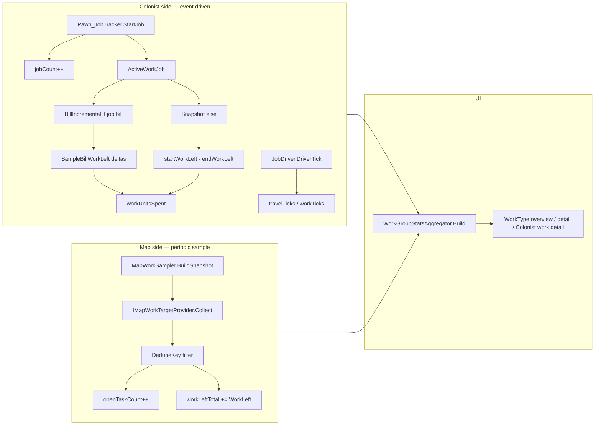

# WorkMonitor — development reference

Read-only RimWorld mod that tracks colonist work activity and map backlog, organized by work type for the Work tab monitor UI.

---

## Glossary

| Term | Meaning |
|------|---------|
| **WorkGiver** (`WorkGiverDef`) | RimWorld def for a single job type (e.g. `DoBillsCook`, `Mine`). Jobs reference one via `job.workGiverDef`. |
| **Work type** (`WorkTypeDef`) | Work-tab column (Cooking, Construction, …). Contains ordered `workGiversByPriority`. Primary unit for **UI navigation** (see [UI views](#ui-views)). |
| **Monitor row** | One row in the WorkType list. Usually one work type; with Work Tab Groups mod may be a custom bucket; unassigned mod work givers appear as **Other**. Code name: `WorkGroupSnapshot` (legacy “group” — avoid in UI copy). |
| **Storage key** | Stable id for a monitor row: `WorkType:Cooking`, `CustomGroup:MyGroup`, `Other:Other`. Built by `WorkGroupKey.StorageKey`. |
| **Job** | Countable colonist metric. Incremented on `Pawn_JobTracker.StartJob` when `workGiverDef` is set. |
| **Work unit** | Numeric “work done” (bill `workLeft` deltas, frame/mine progress, etc.). Not all jobs produce work units. |
| **Tick** | RimWorld time unit. **2500 ticks = 1 in-game hour** (`WorkMonitorSettings.TicksPerHour`). |
| **Travel tick** | Tick spent while `pawn.pather.MovingNow` during an active job. |
| **Work tick** | Tick spent not traveling during an active job. |
| **Open task** (map) | One scannable backlog target at sample time (`openTaskCount++`). |
| **Work left** (map) | Estimated remaining work on a target (`workLeftTotal += target.WorkLeft`). |
| **Countable** | Whether a metric is non-zero for a work giver. Colonist jobs: almost always yes. Map: only when a provider finds a target. |
| **Work gatherable** | Whether work units can be measured. Colonist: bill incremental or snapshot work-left. Map: when `WorkLeft > 0` on the target. |
| **Snapshot mode** | Non-bill jobs: `workDelta = max(0, startWorkLeft - endWorkLeft)` at job end. |
| **Bill incremental mode** | Bill jobs: sum positive deltas of `JobDriver_DoBill.workLeft` each tick. |
| **Scanned map target** | One deduped backlog item from a provider (`ScannedMapTarget`). |
| **Attribution** | Mapping a map target to one or more `WorkGiverDef`s (`MapWorkAttribution`). |
| **Primary work giver** | First entry in `workType.workGiversByPriority` — used as fallback for loose UFT. |
| **Status** | Work-type row health color: Grey (no capable colonists), Red (disabled or stale), Yellow/Green (recent work by enabled colonists). |

---

## Architecture

Two independent data paths feed the UI:



**Colonist stats** update immediately on job start/end and each driver tick.

**Map stats** update on a configurable interval (1/2/3/6/12 in-game hours) for the current map only.

---

## Source layout

```
Source/
├── WorkMonitorMod.cs          # Mod entry, Harmony, settings UI
├── WorkMonitorSettings.cs     # User settings
├── WorkMonitorUtility.cs      # Time formatting, colonist enumeration
├── Groups/                    # Monitor rows (WorkGroup* — code legacy naming)
├── Tracking/
│   ├── WorkActivityTracker.cs # Colonist job/work/tick tracking
│   ├── WorkLeftResolver.cs    # Read work-left from jobs, things, bills
│   ├── MapWorkSampler.cs      # Periodic map snapshot
│   ├── MapWorkSnapshot.cs     # Snapshot DTOs
│   └── MapWork/
│       ├── IMapWorkTargetProvider.cs
│       ├── MapWorkProviderRegistry.cs
│       ├── MapWorkAttribution.cs
│       ├── MapWorkEstimate.cs
│       ├── ScannedMapTarget.cs
│       └── Providers/         # One class per scan source
├── Patches/                   # Harmony hooks
└── UI/                        # Monitor windows and tables
```

---

## Core types and functions

### `WorkActivityTracker` (`GameComponent`)

Colonist-side tracker. Singleton via `Instance` / `EnsureRegistered()`.

| Method | Purpose |
|--------|---------|
| `RecordJobStart(pawn, workGiver, job, tick)` | Finalize prior job, increment job counts, start `ActiveWorkJob` (bill or snapshot mode). |
| `RecordJobEnd(pawn, workGiver, endingJob, tick)` | Finalize active job: ticks, travel/work split, snapshot work delta, bill flush. |
| `SampleBillWorkLeft(pawn, tick)` | Incremental bill work-left credit while job runs. |
| `SampleJobTick(pawn, tick)` | Classify tick as travel vs work on active job. |
| `GetRecord(pawnId, workGiverDefName)` | Lifetime `WorkActivityRecord` per pawn × work giver. |
| `SumPawnWorkGiverJobs/Ticks/WorkUnits/TravelTicks/WorkTicks(...)` | Sum hourly buckets since `minHourIndex`. |
| `GetGroupHistory(storageKey)` | Hourly ring buffer aggregated by monitor row. |
| `PruneStaleData()` | Drop buckets older than `chartHistoryHours`. |

**`ActiveWorkJob`** fields: `workGiverDefName`, `startTick`, `travelTicks`, `workTicks`, `trackingMode`, `tracksWorkLeft`, `startWorkLeft`, `lastBillWorkLeft`, `accumulatedWorkUnits`.

**`WorkActivityRecord`** fields: `lastWorkTick`, `jobCount`, `ticksSpent`, `travelTicksSpent`, `workTicksSpent`, `workUnitsSpent`.

### `WorkLeftResolver` (static)

| Method | Purpose |
|--------|---------|
| `TryGetWorkLeft(job, pawn, out workLeft)` | Bill driver, reflected driver `workLeft`, or target thing (`Frame`, `UnfinishedThing`, `Mineable`). |
| `TryGetBillDriverWorkLeft(pawn, out workLeft)` | `JobDriver_DoBill.workLeft`. |
| `TryGetThingWorkLeft(thing, out workLeft)` | Frame / UFT / mineable hit points. |
| `TryGetBillBacklog(bill, out workLeft, out countable)` | Map-side bill backlog (Forever / TargetCount / RepeatCount + bound UFT). |

### `MapWorkSampler` (`GameComponent`)

| Method | Purpose |
|--------|---------|
| `TrySampleIfDue(force)` | Sample current map when hour aligns with `mapSampleIntervalHours`. |
| `BuildSnapshot(map, hourIndex, sampleTick)` | Run all providers, dedupe, roll up per work giver and monitor row. |
| `GetLatestSnapshot()` | Most recent `MapWorkSnapshot`. |
| `NormalizeInterval(hours)` | Clamp to 1, 2, 3, 6, or 12. |

**`MapWorkSnapshot`** contains `perWorkGiver` and `perGroupKey` dicts of `openTaskCount` + `workLeftTotal`, plus `hourIndex` and `sampleTick`.

### `MapWorkAttribution` (static)

| Method | Purpose |
|--------|---------|
| `ResolveWorkGiversForBillGiver(thing, bill)` | Match `fixedBillGiverDefs`, else primary WG of recipe work skill’s work type. |
| `ResolveWorkGiversForUnfinished(unfinished)` | Skip bound UFT; else primary WG of recipe work type. |
| `PrimaryWorkGiversForWorkType(workType)` | `[workGiversByPriority[0]]`. |
| `ConstructFinishFramesWorkGiver()` | `ConstructFinishFrames` or construction primary. |
| `MineWorkGiver()` / `DrillWorkGiver()` | Named lookup with fallback. |
| `GroupKeysFor(workGivers)` | Distinct group storage keys for attribution. |

### `ScannedMapTarget` (struct)

| Field | Purpose |
|-------|---------|
| `DedupeKey` | Global dedup within one snapshot (e.g. `frame:123`, `bill:loadId`). |
| `WorkLeft` | Work units credited to attributed work givers/groups. |
| `WorkGiverDefNames` | One or more work givers (multi-attribution for bills, frame delivery). |
| `GroupKeys` | Optional; defaults from work givers via `WorkGroupKeyResolver`. |

### `MapWorkEstimate` (static)

Helpers for provider work-left estimates: `FromFrame`, `FromMineable`, `FromFilth`, `FromPlantCut`, `FromThingDeconstruct`, `FromRepair`, `FromSmoothCell` (1500), `ResearchRemaining()`, `FromRecipe`.

### Monitor rows (`Groups/` — code naming)

| Type | Purpose |
|------|---------|
| `WorkGroupKey` | `ForWorkType`, `ForCustomGroup`, `ForOther` → `StorageKey`. |
| `WorkGroupSnapshot` | `Key`, `Label`, `WorkGivers`, `UniqueWorkTypes`, `PrimaryWorkType`. |
| `WorkGroupRegistry.GetAllGroups()` | Monitor rows for WorkType list (work types + custom + Other). |
| `WorkGroupKeyResolver.ResolveGroupKeysForWorkGiver(wg)` | Work type key + optional custom row key. |
| `WorkGroupStatsAggregator.Build(row)` | Merges colonist history + map snapshot into `WorkGroupStats`. |
| `WorkActivityStatus` | `Grey`, `Red`, `Yellow`, `Green`. |

### `WorkMonitorUtility` (static)

`MonitorColonists()`, `CurrentHourIndex()`, `CurrentTicksGame()`, `FormatDuration()`, `FormatWorkUnits()`, `FormatSampleAge()`.

### `WorkMonitorSettings`

| Setting | Default | Purpose |
|---------|---------|---------|
| `statsWindowHours` | 24 | Rolling window for colonist stats in tables. |
| `chartHistoryHours` | 24 | Hourly bucket retention. |
| `greenStatusHours` / `yellowStatusHours` | 6 / 12 | Status color thresholds. |
| `refreshIntervalTicks` | 60 | UI refresh cadence. |
| `mapSampleIntervalHours` | 6 | Map sampler interval (1/2/3/6/12). |
| `showTimeInHours` | true | Display ticks as hours. |
| `showSkillOnWorkGiverLabels` | true | Prefix work giver labels with skill. |
| `workGiverLabelFormat` | `{skill}: {label}` | Label template. |
| `skillRoleOverrides` | `""` | `SkillDef=label` comma list. |
| `workGiverSkillOverrides` | `""` | `WorkGiverDef=true/false` comma list. |

---

## Map work providers

Registered in `MapWorkProviderRegistry.All` (order matters only for collection; dedupe is by `DedupeKey`).

| Provider | Scans | Work giver(s) | Work left |
|----------|-------|---------------|-----------|
| `BillMapWorkProvider` | `IBillGiver` bill stacks | `fixedBillGiverDefs` match or primary by recipe skill | `TryGetBillBacklog` |
| `FrameMapWorkProvider` | Building frames with `WorkLeft > 0` | `ConstructFinishFrames` | `frame.WorkLeft` |
| `FrameDeliveryMapWorkProvider` | Frames needing materials | `ConstructDeliverResourcesToFrames`, `DeliverResourcesToFrames` | 0 (count only) |
| `MineDesignationMapWorkProvider` | `Mine` / `MineVein` designations on mineables | `Mine` | `Mineable.HitPoints` |
| `UnfinishedThingMapWorkProvider` | Loose UFT (`workLeft > 0`, unbound) | Primary WG of recipe work type | `unfinished.workLeft` |
| `DesignationMapWorkProvider` | Cell/thing designations (cut, harvest, smooth, paint, deconstruct, …) | Per-rule `WorkGiverDefName` | Rule estimator or 0 |
| `BrokenDownBuildingMapWorkProvider` | `CompBreakdownable.BrokenDown` | `FixBrokenDownBuilding` | `FromThingDeconstruct` |
| `ListerFilthMapWorkProvider` | Home-area filth | `CleanFilth` | `FromFilth` |
| `ListerFireMapWorkProvider` | Fires on map | `FightFires` | `fireSize * 100` |
| `ListerRepairMapWorkProvider` | Damaged repairable buildings | `Repair` | `FromRepair` |
| `ListerHaulablesMapWorkProvider` | `listerHaulables` | `HaulGeneral` / `HaulCorpses` | 0 |
| `ListerRefuelMapWorkProvider` | Empty `CompRefuelable` | `Refuel` / `RearmTurrets` | 0 |
| `CompBuildingMapWorkProvider` | `CompDeepDrill` ready to drill | `Drill` | 0 |
| `ZoneGrowingMapWorkProvider` | Growing zone harvestable plants / empty sow cells | `GrowerHarvest` / `GrowerSow` | plant harvest / sow work |
| `SnowClearMapWorkProvider` | Home cells with snow | `CleanClearSnow` | `depth * 100` |
| `SingletonResearchMapWorkProvider` | Active research project | `Research` | `ResearchRemaining()` |

**Adding a provider:** implement `IMapWorkTargetProvider`, append to `MapWorkProviderRegistry.AllProviders`, emit `ScannedMapTarget` with a unique `DedupeKey`.

---

## Colonist tracking rules

### Jobs (countable)

**Yes** for any colonist job where `job.workGiverDef != null`, hooked from `Pawn_JobTracker.StartJob`.

### Work units (gatherable)

| Job kind | Mechanism | Work = 0 when |
|----------|-----------|---------------|
| Bill (`job.bill != null`) | Incremental `JobDriver_DoBill.workLeft` each tick + end flush | Driver unreadable |
| Other | Snapshot: `startWorkLeft - endWorkLeft` at job end | `TryGetWorkLeft` fails at start or end |

Work-left sources (in order): bill driver → reflected `workLeft` on `JobDriver` → job target `Frame` / `UnfinishedThing` / `Mineable`.

Jobs like haul, clean, tend, research, flick, etc. record **jobs and ticks** but typically **work units = 0**.

### Ticks

Each `JobDriver.DriverTick`: if `pawn.pather.MovingNow` → travel tick, else work tick. Reconciled to elapsed time on job end.

---

## Map tracking rules

### Countable

Each unique `ScannedMapTarget` (after `DedupeKey` filter) adds **1** to `openTaskCount` per attributed work giver and group.

### Work gatherable

Same target adds `WorkLeft` to `workLeftTotal`. Many providers use **0 work left** for pure “task exists” targets (haul, refuel, drill ready, frame delivery, hunt designation).

### Attribution quirks

- **Bills** → all work givers with matching `fixedBillGiverDefs`; multiple WGs can share one bill target.
- **Loose UFT** → primary WG of recipe work type; bound UFT is skipped (counted via its bill).
- **Frames** → `ConstructFinishFrames` (not construction primary).
- **Mine designations** → `Mine` only (not `Drill`; drill uses `CompBuildingMapWorkProvider`).
- **Per-WG map row sums** can exceed work-type **Total** when one target maps to multiple work givers; work-type totals are deduplicated by `DedupeKey`.

---

## Harmony patches

| Patch | Target | Effect |
|-------|--------|--------|
| `Patch_RecordWorkStart` | `Pawn_JobTracker.StartJob` | End prior job, then `RecordJobStart`. |
| `Patch_RecordWorkEnd` | `Pawn_JobTracker.EndCurrentJob` | `RecordJobEnd`. |
| `Patch_JobDriverTick` | `JobDriver.DriverTick` | `SampleJobTick`; `SampleBillWorkLeft` for bills. |
| `Patch_Game_Constructor` / `Patch_Game_FinalizeInit` | `Game` | Register `WorkActivityTracker` and `MapWorkSampler`. |
| `Patch_History_*` | History tab | Embed Work Monitor UI. |
| `Patch_WorkTab_MonitorButton` | Work tab | Open monitor window. |

Harmony id: `philip2p2026.workmonitor`.

---

## UI views

The monitor is hosted by `WorkMonitorContentHost` inside the History **Work** tab (`Patch_History_*`).

**UI naming uses work type**, not “group”. Code still uses `WorkGroup*` types (`WorkGroupSnapshot`, `WorkGroupDetailPanel`, …) for monitor rows — that is implementation naming only; do not use “group” in player-facing labels.

### The three views

| UI name | Content | `MonitorView` | `ColonistDetailView` | Panel(s) | Translation key |
|---------|---------|---------------|----------------------|----------|-----------------|
| **WorkType overview** | **WorkType list** — all monitor rows with status and map/colonist KPIs | `Overview` | — | `WorkGroupOverviewPanel` | `WorkMonitor.OverviewTitle` |
| **WorkType detail** | **Charts**, **Colonist list** (work done), **WorkGiver list** (map backlog) for one row | `GroupDetail` | — | `WorkGroupDetailPanel`, `WorkGroupChartPanel` | `WorkMonitor.DetailTitle` (`{workType} — Detail`) |
| **Colonist work detail** | **Work list** — per–work-giver breakdown for one colonist | `ColonistDetail` | `GroupWorkDetail` | `ColonistDetailPanel` | `WorkMonitor.ColonistWorkDetailTitle` (`{colonist} — {workType}`) |

**Enum definitions** (`Source/UI/`):

```csharp
// WorkMonitorContentHost.cs
public enum MonitorView { Overview, GroupDetail, ColonistDetail }

// ColonistDetailPanel.cs
public enum ColonistDetailView { GroupsSummary, GroupWorkDetail }
```

`ColonistDetailView.GroupsSummary` is an internal back-navigation state (work-type summary table inside `ColonistDetailPanel`); it is not a top-level `MonitorView`. UI name for the active screen remains **Colonist work detail** when `MonitorView.ColonistDetail` is set.

Enums and `WorkGroup*` type names are **not yet aligned** with UI vocabulary (WorkType overview / detail).

### Navigation

```
WorkType overview (WorkType list)
        │ click row
        ▼
WorkType detail (chart · colonist list · work giver list)
        │ colonist work icon
        ▼
Colonist work detail (work list)
        │ Back
        ▼
WorkType detail
        │ Back
        ▼
WorkType overview
```

Opening **colonist work detail** from WorkType detail pre-selects that work type. The colonist panel may briefly show a work-type summary when backing out internally (`ColonistDetailView.GroupsSummary`); the named UI destination is still **Colonist work detail → Work list**.

### Entry points

| Action | Result |
|--------|--------|
| Open History → Work tab | **WorkType overview** |
| Click a WorkType row | **WorkType detail** for that row |
| WorkType dropdown on detail | Switch detail row without returning to overview |
| Highlight button | `WorkTabHighlightController.HighlightGroup` — jumps to Work tab |
| Colonist work icon on WorkType detail | **Colonist work detail** (pawn + current work type) |
| Colonist dropdown | Switch pawn; preserves work-type scope when possible |

### UI source files

| File | Role | `MonitorView` | `ColonistDetailView` |
|------|------|---------------|----------------------|
| `WorkMonitorContentHost.cs` | View routing | all | — |
| `WorkGroupOverviewPanel.cs` | WorkType overview — WorkType list | `Overview` | — |
| `WorkGroupDetailPanel.cs` | WorkType detail — colonist list + map WorkGiver list | `GroupDetail` | — |
| `WorkGroupChartPanel.cs` | WorkType detail — charts (child of detail panel) | `GroupDetail` | — |
| `ColonistDetailPanel.cs` | Colonist work detail — work list | `ColonistDetail` | `GroupWorkDetail` (also `GroupsSummary` internally) |
| `WorkGroupMonitorWindow.cs` | Standalone window (Work tab monitor button) | hosts `WorkMonitorContentHost` | — |

---

## UI data flow

1. `WorkGroupRegistry.GetAllGroups()` — monitor rows for the WorkType list.
2. `WorkGroupStatsAggregator.Build(row)` — colonist sums from `WorkActivityTracker` hourly buffers + map row from `MapWorkSampler.GetLatestSnapshot()`.
3. Map columns in work-giver rows show `openTaskCount` as **Jobs** and `workLeftTotal` as **Work** (backlog, not spent).
4. Colonist columns show jobs/ticks/work **spent** in `statsWindowHours`.

Detail panels use `ColonistStatsAggregator` and chart builders under `Source/UI/`.

---

## Mod / DLC work givers

Automatic colonist rules apply to any `WorkGiverDef`:

- **Countable:** yes if `workGiverDef` on job and pawn is colonist.
- **Work:** yes if `WorkGiver_DoBill`, or work-left resolvable per `WorkLeftResolver`.

Map side only counts targets found by providers. Unassigned defs appear in the **Other** monitor row (`OtherWorkGroupProvider`).

Optional integration: **Work Tab Groups** mod (`philip2p2026.worktabgroups`) adds custom monitor rows via `WorkTabGroupsProvider`.

---

## Known limitations

1. Map sample is **current map only**; no multi-map aggregation.
2. Map stats are **stale** between samples (age shown via `FormatSampleAge`).
3. Haul/refuel/drill-ready/etc. contribute **open tasks** but often **0 work left**.
4. Colonist **work units** are unavailable for most non-bill, non-work-left jobs.
5. Research/scanner colonist work is job-count only unless driver exposes `workLeft`.
6. `StudyArchotechStructures` / `Hack` may credit work if reflection finds `workLeft` — not verified.
7. Work-type status uses **most recent work tick among enabled capable colonists**, not map backlog.

---

## Work giver coverage summary (vanilla core)

| Side | Countable | Work gatherable |
|------|-----------|-----------------|
| **Colonist** | ~all work givers (~97) | ~35 reliably (`DoBill` + construction/mining/cutting/paint drivers with work-left) |
| **Map** | Expanded beyond bills/frames/mines/UFT: designations, filth, fire, repair, haul, refuel, drill, growing zones, snow, research | Targets with `WorkLeft > 0` or bill/frame/mine/UFT backlog; many listers are count-only |

For per-`WorkGiverDef` tables (vanilla), see `.cursor/plans/workgiver_tracking_matrix_9f6c6690.plan.md`. Update that matrix when providers change; this doc reflects the **provider registry** as the source of truth for map scanning.
